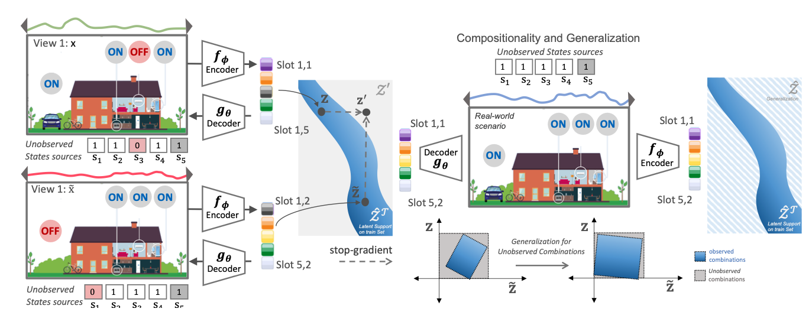

# Identifiability Guarantees For Time Series Representation via Contrastive Sparsity-inducing
Official code for the paper **Identifiability Guarantees For Time Series Representation via Contrastive Sparsity-inducing**

We formalize identifiability  problem for time series variable model where factors are represented by latent slots. 




## Environment Setup
This code was tested for Python 3.10. 

You can start by cloning the repository:

```bash
git clone git@github.com:brendel-group/TimeCSL.git
cd TimeCSL
```

Then, set up your environment by choosing one of the following methods:

<details open>
<summary><strong>Option 1: Installing Dependencies Directly</strong></summary>

```bash
pip install -r requirements.txt
```

</details>

Or, alternatively, you can use Docker:

<details open>
<summary><strong>Option 2: Building a Docker</strong></summary>

Build and run a Docker container using the provided Dockerfile:
```bash
docker build -t TimeCSL .
docker-compose up
```

</details>

## Time series representation

🔗 For understanding how the data looks and to play with the data generation, please refer to the `notebooks/0.  Dataset Example.ipynb` notebook.

🔗 For the actual data generation, please refer to the `notebooks/1. Data.ipynb` notebook. The folder used for saving the dataset at this point will be used for training and evaluation.

## Training and Evaluation

### Training
To train the model, run the following command:

```bash
python main.py --dataset_path last_step" --model_name "TimeCSL" --num_slots 2 --epochs 200 --use_addititvity_loss True
```

For complete details on the parameters, please refer to the `main.py` file.

You can find some example commands for training below:

<details open>
<summary><strong>Different Training Setups</strong></summary>

- <details>
  <summary><strong>Training SlotAttention</strong></summary>

  Training vanilla SlotAttention with 2 slots:
  ```bash
  python main.py --dataset_path "/path/from/previous/step" --model_name "SlotAttention" --num_slots 2 --use_consistency_loss False
  ```

  Training vanilla SlotAttention with 2 slots and consistency loss:
  ```bash
  python main.py --dataset_path "/path/from/previous/step" --model_name "SlotAttention" --num_slots 2 --use_consistency_loss True --consistency_ignite_epoch 150
  ```

  Training SlotAttention with 2 slots, fixed SoftMax and sampling:
  ```bash
  python main.py --dataset_path "/path/from/previous/step" --model_name "SlotAttention" --num_slots 2 --use_consistency_loss True --consistency_ignite_epoch 150 --softmax False --sampling False
  ```
</details>

- <details>
  <summary><strong>Training AE Model</strong></summary>

  Training vanilla autoencoder with 2 slots:
  ```bash
  python main.py --dataset_path "/path/from/previous/step" --model_name "SlotMLPAdditive" --epochs 300 --num_slots 2 -n_slot_latents 6 --use_consistency_loss False
  ```

  Training vanilla autoencoder with 2 slots and consistency loss:
  ```bash
  python main.py --dataset_path "/path/from/previous/step" --model_name "SlotMLPAdditive" --epochs 300 --num_slots 2 -n_slot_latents 6 --use_consistency_loss True --consistency_ignite_epoch 100
  ```

</details>

</details>

### Evaluation

Evaluation can be done using the `evaluate.py` script and closely follows the procedure and metrics used in the training script. The main difference is in calculating the compositional contrast (note: it might cause OOM issues, thus is calculated only for the AE model).

Here is an example command for evaluation:
```bash
python src/evaluation.py --dataset_path "/path/from/previous/step" --model_path "checkpoints/SlotMLPAdditive.pt" --model_name "SlotMLPAdditive" --n_slot_latents 6
```